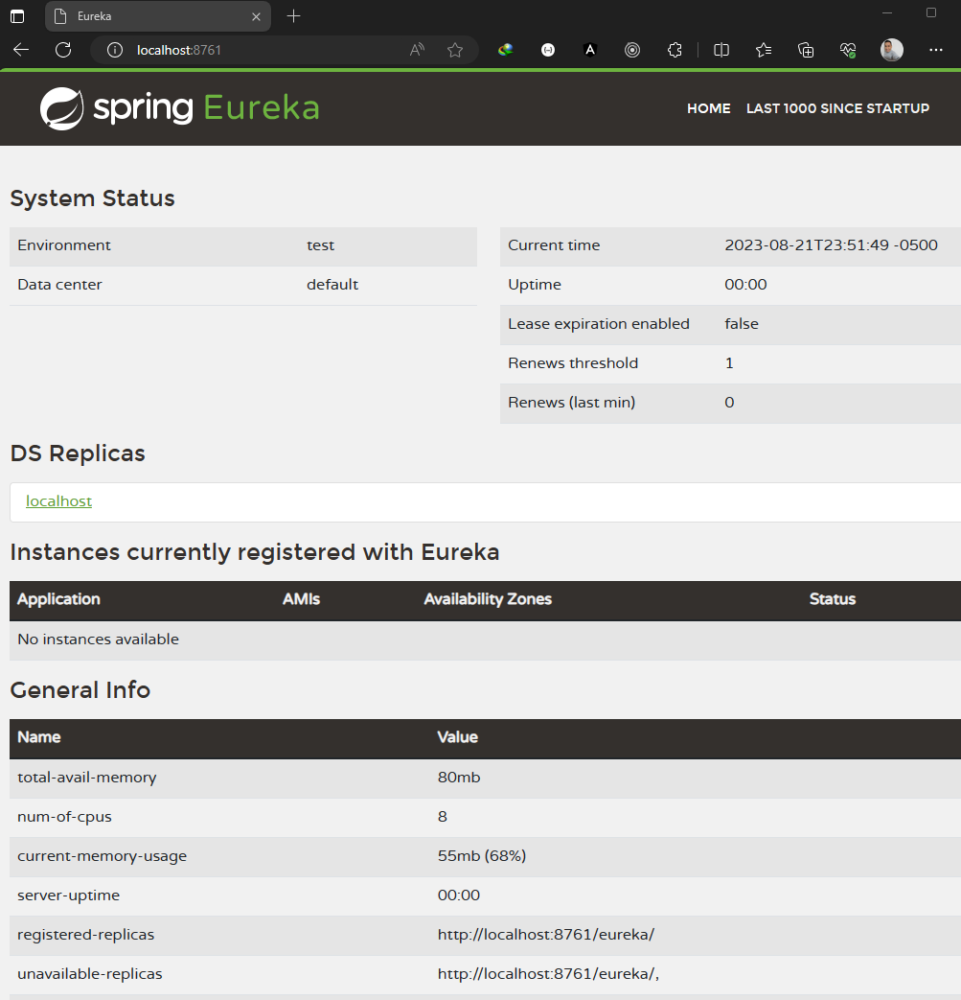

# Sección: Spring Cloud Eureka Server: Registrando los microservicios

---

[Según la documentación de eureka](https://docs.spring.io/spring-cloud-netflix/docs/4.0.1/reference/html/#jdk-11-support):  
Los módulos JAXB de los que depende el servidor Eureka se eliminaron en JDK 11
**[en realidad según Andrés Guzmán es desde 9+]**. Si tiene la intención de utilizar JDK 11 [o superior]
cuando ejecute un servidor Eureka, debe incluir esta dependencia en su archivo POM o Gradle.

````xml

<dependency>
    <groupId>org.glassfish.jaxb</groupId>
    <artifactId>jaxb-runtime</artifactId>
</dependency>
````

En mi caso, como **estoy usando la versión 17 de java**, es necesario agregar dicha dependencia.

Finalmente, las dependencias incluidas en este proyecto de Eureka Server son:

````xml
<!--Versión de Spring Boot: 3.1.2-->
<!--Versión de java: 17-->
<!--Versión de Spring Cloud: 2022.0.4-->
<dependencies>
    <dependency>
        <groupId>org.springframework.boot</groupId>
        <artifactId>spring-boot-starter-webflux</artifactId>
    </dependency>
    <dependency>
        <groupId>org.springframework.cloud</groupId>
        <artifactId>spring-cloud-starter-netflix-eureka-server</artifactId>
    </dependency>
    <dependency>
        <groupId>org.glassfish.jaxb</groupId>
        <artifactId>jaxb-runtime</artifactId>
    </dependency>

    <dependency>
        <groupId>org.springframework.boot</groupId>
        <artifactId>spring-boot-starter-test</artifactId>
        <scope>test</scope>
    </dependency>
    <dependency>
        <groupId>io.projectreactor</groupId>
        <artifactId>reactor-test</artifactId>
        <scope>test</scope>
    </dependency>
</dependencies>
````

## Habilitando el proyecto como un servidor Eureka

Para decirle a Spring Boot que este proyecto será un Servidor Eureka vamos a la clase principal y lo anotamos con
`@EnableEurekaServer`

````java

@EnableEurekaServer //<-- Habilitando el proyecto como servidor de eureka
@SpringBootApplication
public class SpringWebfluxEurekaServerApplication {
    public static void main(String[] args) {
        SpringApplication.run(SpringWebfluxEurekaServerApplication.class, args);
    }
}
````

## Configurando application.properties

````properties
#(1)
spring.application.name=service-eureka-server
#(2)
server.port=8761
#
#
#(3)
eureka.client.register-with-eureka=false
eureka.client.fetch-registry=false
````

- **(1)**, le damos un nombre cualquiera a nuestra aplicación, en nuestro caso se llamará `service-eureka-server`.
- **(2)**, por defecto el puerto del **Servidor de Eureka** es el 8761.
- **(3)**, por defecto **el servidor de eureka, a parte de ser un servidor, se registra a sí mismo como un cliente**. En
  nuestro caso, **solo queremos que sea un servidor**, por lo tanto, agregaremos las dos configuraciones que
  deshabilitarán a Eureka como cliente y solo lo dejarán como un servidor.

## Ejecutando el proyecto

Si ejecutamos el proyecto, podemos ver eureka server en funcionamiento a través del navegador `http://localhost:8761/`:


